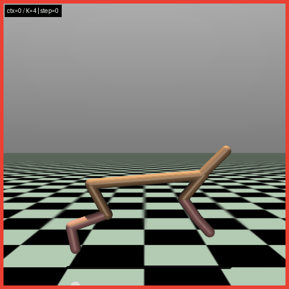

# [VALOR](https://arxiv.org/pdf/1807.10299)

This is a PyTorch implementation of [VALOR](https://arxiv.org/pdf/1807.10299) — **Visual-Action Latent Optimization for Reinforcement Learning** — a method designed to learn rich visual-latent representations from high-dimensional observations to accelerate and stabilize policy learning. This repository provides suppoprt training, evaluation, and visualizations of VALOR on MuJoCo Gym environments.

### Environment Set-up
```bash
git clone https://github.com/JamesJDill/VALOR.git
cd VALOR

conda create -n valor python=3.11 -y
conda activate valor

pip install -r requirements.txt
```

If you want to also add visual renderings of the contexts' trajectories, I find that you may have to run the following. This was very specific to my environment during testing and you may not need this. There may be bugs in the rendering depending what environment you're running on (i.e. a headless environment or not). At the very least the training shouuld work regardless.
```bash
conda install -c conda-forge -y "libstdcxx-ng>=13" "libgcc-ng>=13"
```

Example Rendered context trajectory.



# Demo
Run all the cells in demo.ipynb in order to run a training and see the associated evaluations/visualizations. If the final renderings work try the command above, otherwise it will probably be machine dependent.

This REPO was tested and trained using a GPU. CPU is untested but should work. Make sure to decrease NUM_ENVS during training if on CPU.
